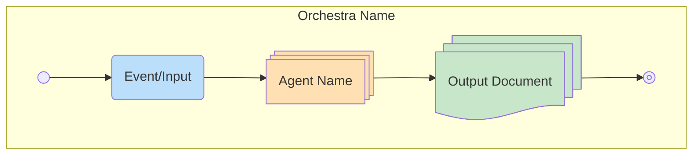

# CLAUDE.md

This file provides guidance to Claude Code (claude.ai/code) when working with code in this repository.

## Repository Purpose

This is a **production automation system** for AI-powered resume and cover letter tailoring using multi-agent orchestration.

The system leverages 24 specialized AI agents coordinated by 8 orchestrators to:
1. Match your master resume against job descriptions
2. Generate tailored resumes and cover letters for each position
3. Fact-check against your master resume to prevent hallucinations
4. Optimize document length through intelligent pruning
5. Compile final PDFs using LaTeX templates

## High-Level Architecture

### Multi-Agent Orchestration System

The Python system (`src/`) implements a sophisticated multi-agent architecture:

- **24 Specialized Agents** - Each with single responsibility (matching, writing, fact-checking, pruning, etc.)
- **8 Orchestrators** - Coordinate agents through sequential workflow stages
- **Generic Base Classes** - `BaseAgent[InputT, OutputT]` with type safety throughout
- **Async/Await Pattern** - All agents and orchestrators use async execution
- **State Management** - Comprehensive checkpointing system for recovery and debugging

### Workflow Pipeline Stages

```
1. INPUT_PREPARATION → Read master resume, fetch job descriptions, parse JDs
2. JD_MATCHING → Rank and select best-fit job descriptions
3. WRITING_POLISHING → Generate tailored resumes and cover letters (parallel)
4. FACT_CHECKING → Iterative verification against master resume
5. PRUNING → LaTeX compilation and length optimization with human review
6. COMPLETED → Final PDFs in data/runs/run-{uuid}/release/
```

Each stage is checkpointed, allowing recovery from any point if interrupted.

### Key Architectural Patterns

**1. Mermaid-First Design**
- Workflows are designed as mermaid diagrams (`.mmd` files) **first**
- Python orchestrators implement the diagrams **second**
- Diagrams serve as both specification and documentation
- All diagrams use standardized structure: `config: { layout: dagre/elk }`, consistent node shapes, color-coded classDefs

**2. Role-Specific Guidelines System**
- Not one-size-fits-all: separate guidelines for each role/level combination
- Located in `data/inputs/{role}/`:
  - `resume-guidelines.md` - Theoretical best practices
  - `resume-top-patterns.md` - Real-world successful patterns
  - `cover-letter-guidelines.md` - Cover letter guidance
  - `cover-letter-top-patterns.md` - Effective examples
- Roles: `backend`, `sr-backend`, `swe`, `sr-swe`, `data-eng`, `sr-data-eng`

**3. Iterative Refinement with Quality Gates**
```python
max_iterations = 10  # Configurable
quality_threshold = 0.8  # Configurable

while iteration < max_iterations and score < quality_threshold:
    draft = generate_draft()
    issues = evaluate_draft(draft)
    draft = fix_issues(draft, issues)
    score = calculate_quality(draft)
```

Applied to resume drafting, cover letter writing, document polishing, and best practices merging.

**4. Human-in-the-Loop Design**
- Interactive wizard (`src/human/wizard.py`) using Rich terminal UI
- Human review during pruning stage for final approval
- All user interaction through beautiful CLI (colored output, progress bars, panels, tables)

**5. Parallel Processing with Configurable Concurrency**
- `AgentPool` manages concurrent agent execution
- Configurable pool size (1 for debug, unlimited for speed)
- Multiple job descriptions processed in parallel
- Prevents API rate limit issues

**6. Comprehensive State Persistence**
```
data/runs/run-{uuid}/
├── checkpoints/           # JSON state at each stage
├── inputs/                # Fetched job descriptions
├── drafts/                # All version iterations
└── release/               # Final PDFs
```

Filesystem-based (no database) - simple, transparent, debuggable.

**7. AI Detection for Cover Letters**
- Unique concern: cover letters must not sound AI-generated
- `AIWrittenDetector` agent with 0.999 threshold
- `DraftHumanizer` agent invoked if detection exceeds threshold
- Ensures authentic, human-sounding output

**8. LaTeX Integration**
- All documents generated as LaTeX source
- `TexTemplateFiller` agent populates templates
- `TexCompiler` agent generates PDFs
- Template variables allow customization per role

## Common Development Commands

### Installation

```bash
# Development installation with linting tools
pip install -e ".[dev]"

# Production installation
pip install -r requirements.txt
```

### Running the System

```bash
# Main orchestration system (interactive wizard)
python -m src.main

# Or via Claude Code slash command
/tailor

# Standalone best practices merger
python -m src.merger_main \
  --r1 data/inputs/backend/resume-guidelines.md \
  --r2 data/inputs/backend/resume-top-patterns.md \
  --document-type resume \
  --max-iterations 5
```

### Testing

```bash
# Run all tests
pytest

# Run with coverage report
pytest --cov=src --cov-report=html

# Run specific test file
pytest tests/test_agents.py

# Run specific test
pytest tests/test_agents.py::test_resume_jd_matcher
```

**Note**: Test suite is currently minimal - identified as technical debt.

### Linting and Code Quality

```bash
# Format code (line length: 100)
black src/

# Lint with ruff (comprehensive rule set)
ruff check src/

# Auto-fix issues
ruff check --fix src/

# Type checking (strict mode)
mypy src/
```

**Linting Configuration**:
- **Black**: line-length=100, Python 3.11+
- **Ruff**: E, W, F, I, B, C4, UP, ARG, SIM, PTH rules enabled
- **MyPy**: Strict mode with full type checking

### Diagram Rendering

```bash
# Install mermaid-cli globally
npm install -g @mermaid-js/mermaid-cli

# Render single diagram
mmdc -i 03.TailoringOrchestra.mmd -o rendered/03.png

# Render all diagrams to rendered/ directory
mkdir -p rendered
for file in *.mmd; do
  mmdc -i "$file" -o "rendered/${file%.mmd}.png"
done
```

**Note**: Rendered outputs (PNG, SVG) are gitignored and should not be committed.

## Configuration System

### Pydantic-Based Validation

All configuration uses Pydantic models (`src/config.py`):

```python
class Config(BaseModel):
    max_iterations: int = 10
    quality_threshold: float = 0.8
    agent_pool_size: int | None = None  # None = unlimited

    @field_validator('quality_threshold')
    @classmethod
    def validate_quality_threshold(cls, v: float) -> float:
        if not 0 <= v <= 1:
            raise ValueError("Quality threshold must be between 0 and 1")
        return v
```

### Key Configuration Options

- `max_iterations` - Maximum refinement loops (default: 10)
- `quality_threshold` - Minimum quality score to accept (default: 0.8)
- `agent_pool_size` - Concurrent agent limit (default: None/unlimited, use 1 for debug)
- `ai_detection_threshold` - Cover letter AI detection limit (default: 0.999)

## Directory Structure

### Source Code (`src/`)

- `src/main.py` - Main entry point with interactive wizard
- `src/merger_main.py` - Standalone merger CLI
- `src/config.py` - Pydantic configuration models
- `src/agents/` - 24 specialized agents organized by function:
  - `input_prep/` - Input reading, document fetching, JD parsing
  - `matching/` - Resume-JD matching, JD ranking/selection
  - `writing/` - Draft writing, fact checking, evaluation, polishing, humanization
  - `pruning/` - LaTeX compilation, impact calculation, change ranking, execution
  - `research/` - Best practices merging
- `src/orchestrators/` - 8 workflow coordinators mapping to mermaid diagrams
- `src/human/` - Interactive wizard and feedback collection
- `src/merger/` - Standalone best practices merger engine
- `src/state/` - State management and checkpoint system
- `src/decisions/` - Automated decision logic
- `src/utils/` - Logging and utilities

### Data (`data/`)

- `data/inputs/` - Role-specific guidelines and master resume
  - `data/inputs/{role}/resume-guidelines.md` - Best practices
  - `data/inputs/{role}/resume-top-patterns.md` - Successful patterns
  - `data/inputs/{role}/cover-letter-*.md` - Cover letter guidance
  - `data/inputs/resume.md` - Master resume (source of truth)
- `data/test/` - Sample test data for development
- `data/runs/` - Runtime outputs (gitignored)
  - Checkpoints for recovery
  - Draft iterations
  - Final PDFs in `release/`

### Documentation (`docs/`)

- `docs/architecture.md` - Comprehensive system architecture (551 lines)
- `docs/configuration.md` - Configuration options and examples
- `docs/usage.md` - Detailed usage guide
- `docs/development.md` - Developer guide

### Workflow Diagrams (Root `.mmd` files)

Sequential numbering system documenting complete workflow:

1. `00.CompanyResearchDiagram.mmd` - Company culture research
2. `01.MasterResumediagram.mmd` - Master resume maintenance
3. `02.1.BestPracticesResearch.CoverLetter.mmd` - Cover letter best practices
4. `02.2.BestPracticesResearch.Resume.mmd` - Resume best practices
5. `03.TailoringOrchestra.mmd` - Master orchestration overview
6. `04.InputPreparation.mmd` - Input data preparation stage
7. `05.JDMatchingOrchestra.mmd` - Job description matching stage
8. `06.1.WritingOrchestra.Resume.mmd` - Resume writing workflow
9. `06.2.WritingOrchestra.CoverLetter.mmd` - Cover letter writing workflow
10. `07.FactCheckerLoopOrchestra.mmd` - Fact verification loop
11. `09.PruningOrchestra.mmd` - Content optimization stage

**Naming Convention**: `##.SubNumber.Purpose.DocumentType.mmd`

## Workflow Diagram Conventions

All mermaid diagrams follow standardized structure:



**Key Elements**:
- **Consistent color coding** - Red for orchestras, blue for events, green for outputs, orange for agents
- **Standardized shapes** - `start`, `stop`, `event`, `procs` (processes), `docs` (documents), `diam` (decisions)
- **Nested subgraphs** - Parent orchestra contains sub-orchestras
- **Clear data flow** - Arrows show input/output relationships between agents

## Agent Design Principles

### Generic Base Class

```python
class BaseAgent(ABC, Generic[InputT, OutputT]):
    """Base class for all agents with type-safe inputs/outputs."""

    @abstractmethod
    async def execute(self, input_data: InputT) -> OutputT:
        """Execute agent logic asynchronously."""
        pass

    async def validate_input(self, input_data: InputT) -> bool:
        """Validate input before execution."""
        pass
```

### Key Agents by Category

**Input Preparation**:
- `InputReader` - Reads master resume and role guidelines
- `DocumentFetcher` - Fetches job descriptions from URLs
- `JDParser` - Extracts structured data from JD HTML

**Matching**:
- `ResumeJDMatcher` - Calculates fit scores between resume and JDs
- `JDsRankerSelector` - Ranks JDs and selects best matches

**Writing** (9 agents):
- `DraftWriter` - Generates initial resume/cover letter drafts
- `FactChecker` - Verifies claims against master resume
- `RevisedDraftWriter` - Fixes issues identified by fact checker
- `DocumentEvaluator` - Scores quality and identifies remaining issues
- `IssueFixer` - Addresses evaluation issues
- `DocumentPolisher` - Final refinement
- `AIWrittenDetector` - Detects AI-generated text patterns
- `DraftHumanizer` - Rewrites to sound more human
- `VersionManager` - Tracks draft iterations

**Pruning** (9 agents):
- `TexTemplateFiller` - Populates LaTeX templates
- `TexCompiler` - Compiles LaTeX to PDF
- `TextImpactCalculator` - Analyzes removal/rewriting impact
- `RemovalEvaluator` - Suggests content to remove
- `RewritingEvaluator` - Suggests concise rewrites
- `DeltaCalculator` - Calculates word/character savings
- `ChangesRanker` - Ranks changes by impact/savings
- `ChangeExecutor` - Applies approved changes

**Research**:
- `BestPracticesMerger` - Merges theoretical and practical guidelines

## State Management

### RunContext

Central state container throughout orchestration:

```python
@dataclass
class RunContext:
    config: Config
    state_manager: StateManager
    current_stage: OrchestrationStage
    context_data: Dict[str, Any]  # Artifacts from completed stages
    error_log: List[Dict[str, Any]]
```

### Orchestration Stages

```python
class OrchestrationStage(Enum):
    INITIALIZATION = "initialization"
    INPUT_PREPARATION = "input_preparation"
    JD_MATCHING = "jd_matching"
    WRITING_POLISHING = "writing_polishing"
    FACT_CHECKING = "fact_checking"
    PRUNING = "pruning"
    COMPLETED = "completed"
    FAILED = "failed"
```

### Checkpoint System

Every stage saves checkpoint with:
- Timestamp
- Stage name
- Input/output data
- Error logs
- Duration metrics

Allows recovery from any point after interruption or failure.

## Git Workflow

### Branch Naming

Follow conventional branch naming from global CLAUDE.md (`~/.claude/instructions/conventional-branch.md`).

### Commit Conventions

Follow conventional commits from global CLAUDE.md (`~/.claude/instructions/conventional-commits.md`):
- `feat:` - New features
- `fix:` - Bug fixes
- `docs:` - Documentation updates
- `refactor:` - Code refactoring
- `test:` - Test additions

### What's Gitignored

- `data/runs/` - Runtime outputs and checkpoints
- `rendered/` - Generated diagram images
- Python cache files (`__pycache__`, `*.pyc`)
- Virtual environments
- `.env` files

## Development Notes

### Testing Gap

The `tests/` directory exists but currently has minimal test coverage. This is identified technical debt. When writing tests:

- Use `pytest` with async support (`pytest-asyncio`)
- Follow TDD for new features
- Target >90% coverage for production readiness
- Test both agents and orchestrators

### API Usage

All LLM calls use Anthropic's Claude API (`anthropic` package):
- Configured via environment variables
- No hardcoded API keys
- Async client throughout
- Designed for Claude Code Task tool integration

### Rich Terminal UI

All user interaction uses Rich library:
- `Console` for colored output
- `Progress` for progress bars
- `Panel` for sections
- `Table` for results
- `Prompt` for input collection

Example:
```python
from rich.console import Console

console = Console()
console.print("[bold cyan]Stage Complete![/bold cyan]")
```

## Related Repositories

This repository is part of a job application optimization ecosystem:

1. **job-applications** (private) - Actual application documents and tracking
2. **job-hunting-automation** (public) - Additional automation tools
3. **latex-templates** (public) - Document templates used by pruning stage
