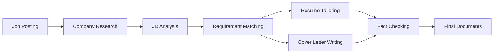

# ATS Research & Resume Tailoring Documentation

Welcome to the comprehensive documentation for the ATS (Applicant Tracking System) research and resume/cover letter tailoring orchestration system.

## Overview

This project provides a systematic, agent-based approach to optimizing job applications through:

1. **ATS Platform Research**: Comprehensive analysis of top ATS platforms and their optimization requirements
2. **Workflow Orchestration**: Multi-stage diagrams representing the complete job application preparation workflow
3. **Python Automation**: Agent-based orchestration system for tailoring resumes and cover letters

## Project Purpose

The system helps job seekers create highly optimized, ATS-friendly application materials by:

- Researching company culture and values
- Analyzing job descriptions for key requirements
- Matching candidate experience to job requirements
- Tailoring resumes and cover letters for specific positions
- Ensuring human-written quality while maintaining ATS compatibility

## Quick Start

### Prerequisites

- Python 3.8+
- Required packages: `pyyaml`, `anthropic` (for Claude API), `openai` (for GPT API)

### Installation

```bash
# Clone the repository
git clone https://github.com/yourusername/ats-research.git
cd ats-research

# Install dependencies
pip install -r requirements.txt
```

### Basic Usage

```bash
# Interactive wizard (recommended for first-time users)
python src/main.py

# Or use directly with a job posting
python src/main.py --jd path/to/job_description.html
```

See [Usage Guide](usage.md) for detailed instructions.

## Documentation Structure

This documentation is organized into the following sections:

1. **[Architecture](architecture.md)**: System design, components, and workflow diagrams
2. **[Configuration](configuration.md)**: Configuration options and customization
3. **[Usage Guide](usage.md)**: Getting started and practical examples
4. **[Development](development.md)**: Contributing and extending the system

## Key Features

### 1. ATS Platform Research

Comprehensive analysis of top 20 ATS platforms with:
- Market share data
- Feature comparisons
- Optimization recommendations
- Platform-specific quirks and requirements

See `top20.md` for detailed research findings.

### 2. Workflow Orchestration Diagrams

Sequential workflow stages represented as Mermaid diagrams:

1. **Company Research** (00) - Culture and values analysis
2. **Master Resume** (01) - Comprehensive experience repository
3. **Best Practices Research** (02.1, 02.2) - Resume and cover letter guidelines
4. **Tailoring** (03) - Resume customization workflow
5. **Input Preparation** (04) - Job description preprocessing
6. **JD Matching** (05) - Requirement-experience matching
7. **Writing Orchestras** (06.1, 06.2) - Document generation
8. **Fact Checking** (07) - Accuracy verification
9. **Pruning** (09) - Content optimization

### 3. Python Automation System

Agent-based orchestration with:
- Modular agent architecture
- State management and workflow coordination
- Multiple LLM support (Claude, GPT)
- Interactive and programmatic modes

## Workflow Overview



## Repository Structure

```
ats-research/
├── README.md                 # Project overview
├── top20.md                  # ATS platform research
├── *.mmd                     # Workflow diagrams
├── data/
│   └── test/                 # Test fixtures
├── docs/                     # This documentation
├── src/
│   ├── agents/              # Agent implementations
│   ├── orchestras/          # Workflow orchestrators
│   ├── utils/               # Shared utilities
│   ├── config.py            # Configuration
│   └── main.py              # Entry point
└── requirements.txt         # Python dependencies
```

## Related Repositories

This repository is part of a job application optimization ecosystem:

1. **ats-research** (this repo) - Research and orchestration
2. **job-applications** (private) - Actual application documents
3. **job-hunting-automation** (public) - Additional automation tools
4. **latex-templates** (public) - Document templates

## Contributing

See [Development Guide](development.md) for contribution guidelines.

## License

MIT License - See LICENSE file for details.

## Support

For issues, questions, or contributions:
- Open an issue on GitHub
- Review existing documentation
- Check the troubleshooting section in [Usage Guide](usage.md)

## Next Steps

1. Read the [Architecture Guide](architecture.md) to understand system design
2. Follow the [Usage Guide](usage.md) for practical examples
3. Review [Configuration](configuration.md) for customization options
4. See [Development Guide](development.md) to extend the system
