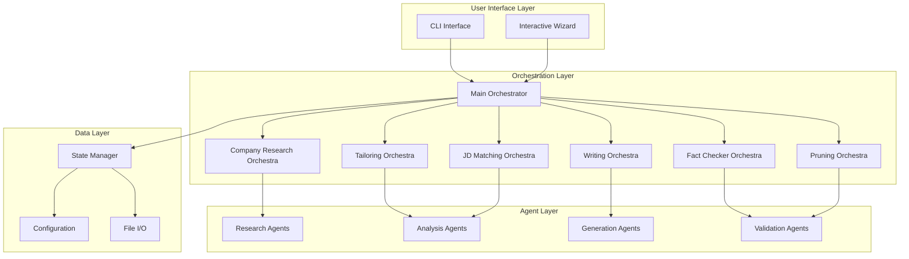
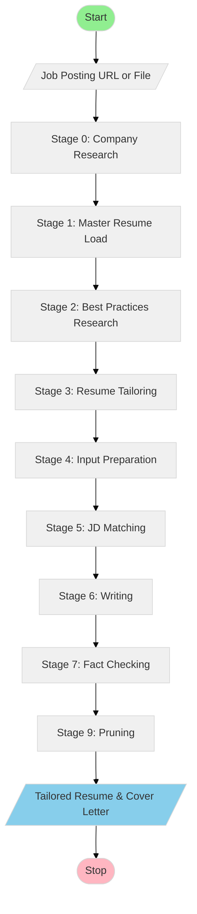

# System Architecture

This document describes the architecture of the ATS research and resume tailoring orchestration system.

## Table of Contents

1. [Overview](#overview)
2. [System Components](#system-components)
3. [Workflow Orchestration](#workflow-orchestration)
4. [Agent Catalog](#agent-catalog)
5. [State Management](#state-management)
6. [Decision Logic Framework](#decision-logic-framework)

## Overview

The system is built on an **agent-based orchestration architecture** where specialized agents handle specific tasks, coordinated by orchestra controllers that manage workflow state and decision logic.

### Design Principles

1. **Separation of Concerns**: Each agent has a single, well-defined responsibility
2. **Composability**: Agents can be combined in different orchestration patterns
3. **Flexibility**: Support for multiple LLM providers and custom agents
4. **State Management**: Centralized state tracking across workflow stages
5. **Human-in-the-Loop**: Interactive decision points for quality control

## System Components



### Component Responsibilities

#### User Interface Layer

- **CLI Interface**: Command-line argument parsing and direct execution
- **Interactive Wizard**: Guided step-by-step workflow with user prompts

#### Orchestration Layer

- **Main Orchestrator** (`main.py`): Entry point, coordinates overall workflow
- **Orchestra Controllers**: Manage multi-stage workflows for specific domains
  - Company Research Orchestra
  - Tailoring Orchestra
  - JD Matching Orchestra
  - Writing Orchestra (Resume & Cover Letter)
  - Fact Checker Orchestra
  - Pruning Orchestra

#### Agent Layer

- **Research Agents**: Web scraping, information gathering
- **Analysis Agents**: Requirement extraction, matching, scoring
- **Generation Agents**: Content writing, formatting
- **Validation Agents**: Fact checking, quality verification

#### Data Layer

- **State Manager**: Workflow state persistence and retrieval
- **Configuration**: User preferences and system settings
- **File I/O**: Document reading/writing utilities

## Workflow Orchestration

### Complete Workflow Sequence

The system implements a sequential workflow with the following stages:



### Orchestra Diagrams

Each stage is represented by a Mermaid diagram file in the repository root:

1. **00.CompanyResearchDiagram.mmd**: Company culture and values research
2. **01.MasterResumediagram.mmd**: Master resume maintenance structure
3. **02.1.BestPracticesResearch.CoverLetter.mmd**: Cover letter optimization guidelines
4. **02.2.BestPracticesResearch.Resume.mmd**: Resume optimization guidelines
5. **03.TailoringOrchestra.mmd**: Resume tailoring workflow
6. **04.InputPreparation.mmd**: Job description preprocessing
7. **05.JDMatchingOrchestra.mmd**: Requirement-experience matching
8. **06.1.WritingOrchestra.Resume.mmd**: Resume generation
9. **06.2.WritingOrchestra.CoverLetter.mmd**: Cover letter generation
10. **07.FactCheckerLoopOrchestra.mmd**: Accuracy verification
11. **09.PruningOrchestra.mmd**: Content optimization

### State Transitions

Each orchestra manages state transitions:

```python
class WorkflowState(Enum):
    INITIALIZED = "initialized"
    COMPANY_RESEARCH_COMPLETE = "company_research_complete"
    MASTER_RESUME_LOADED = "master_resume_loaded"
    BEST_PRACTICES_LOADED = "best_practices_loaded"
    JD_ANALYZED = "jd_analyzed"
    REQUIREMENTS_MATCHED = "requirements_matched"
    RESUME_DRAFTED = "resume_drafted"
    COVER_LETTER_DRAFTED = "cover_letter_drafted"
    FACT_CHECKED = "fact_checked"
    PRUNED = "pruned"
    COMPLETE = "complete"
```

## Agent Catalog

### Research Agents

#### CompanyResearchAgent

**Purpose**: Gather company culture, values, and work environment information

**Inputs**:
- `company_name`: String - Company name
- `company_url`: Optional[String] - Company website URL
- `job_posting_url`: Optional[String] - Job posting URL

**Outputs**:
- `culture_summary`: Dict - Culture and values summary
- `work_environment`: Dict - Work environment details
- `candidate_values`: List[String] - What they value in candidates

**Configuration**:
- `research_depth`: "quick" | "standard" | "deep"
- `sources`: List of research sources to use

---

#### BestPracticesResearchAgent

**Purpose**: Retrieve and synthesize resume/cover letter best practices

**Inputs**:
- `document_type`: "resume" | "cover_letter"
- `focus_areas`: Optional[List[String]] - Specific areas to research

**Outputs**:
- `best_practices`: Dict - Structured best practices guide
- `ats_optimization_tips`: List[String] - ATS-specific tips
- `formatting_guidelines`: Dict - Formatting recommendations

**Configuration**:
- `sources`: ATS research files, industry guides
- `update_frequency`: How often to refresh best practices

### Analysis Agents

#### JDParserAgent

**Purpose**: Extract structured requirements from job descriptions

**Inputs**:
- `jd_html`: String - Raw HTML of job description
- `jd_text`: Optional[String] - Plain text fallback

**Outputs**:
- `required_skills`: List[String] - Must-have skills
- `preferred_skills`: List[String] - Nice-to-have skills
- `responsibilities`: List[String] - Key responsibilities
- `qualifications`: Dict - Education, experience requirements
- `keywords`: List[String] - Important keywords for ATS

**Processing Steps**:
1. Parse HTML structure
2. Identify requirement sections
3. Extract and categorize skills
4. Identify action verbs and keywords
5. Score requirement priority

---

#### RequirementMatcherAgent

**Purpose**: Match candidate experience to job requirements

**Inputs**:
- `master_resume`: Dict - Parsed master resume
- `job_requirements`: Dict - Parsed JD requirements
- `company_culture`: Dict - Company culture research

**Outputs**:
- `matched_experiences`: List[Dict] - Relevant experiences with match scores
- `skill_gaps`: List[String] - Missing skills
- `strength_areas`: List[String] - Strong match areas
- `tailoring_recommendations`: List[Dict] - Specific tailoring suggestions

**Scoring Algorithm**:
```python
def calculate_match_score(experience, requirement):
    """
    Score ranges from 0-100:
    - 90-100: Perfect match with quantified achievements
    - 70-89: Strong match with relevant experience
    - 50-69: Moderate match, transferable skills
    - 30-49: Weak match, needs highlighting
    - 0-29: Poor match, consider omitting
    """
    score = 0
    score += keyword_match(experience, requirement) * 40
    score += skill_overlap(experience, requirement) * 30
    score += achievement_relevance(experience, requirement) * 20
    score += recency_factor(experience) * 10
    return score
```

### Generation Agents

#### ResumeTailoringAgent

**Purpose**: Generate tailored resume content based on matching analysis

**Inputs**:
- `master_resume`: Dict - Complete resume data
- `match_analysis`: Dict - Requirement matching results
- `best_practices`: Dict - Resume best practices
- `target_length`: Int - Target page count (1-2)

**Outputs**:
- `tailored_resume`: Dict - Structured resume data
- `highlighted_skills`: List[String] - Skills to emphasize
- `reordered_experiences`: List[Dict] - Prioritized experience list

**Tailoring Strategies**:
1. **Keyword Optimization**: Incorporate JD keywords naturally
2. **Experience Prioritization**: Reorder based on relevance scores
3. **Achievement Highlighting**: Emphasize quantified results matching requirements
4. **Skill Section Customization**: Add/remove skills based on JD
5. **Summary Customization**: Align professional summary with role

---

#### CoverLetterWriterAgent

**Purpose**: Generate personalized cover letter

**Inputs**:
- `company_culture`: Dict - Company research results
- `job_requirements`: Dict - Parsed JD
- `matched_experiences`: List[Dict] - Top relevant experiences
- `candidate_name`: String
- `hiring_manager`: Optional[String]

**Outputs**:
- `cover_letter`: String - Complete cover letter text
- `key_points`: List[String] - Main arguments/selling points

**Structure**:
1. **Opening** (2-3 sentences): Hook, position interest, company research
2. **Body Paragraph 1** (4-5 sentences): Top relevant experience with achievement
3. **Body Paragraph 2** (4-5 sentences): Additional experience or cultural fit
4. **Closing** (2-3 sentences): Enthusiasm, call to action, availability

### Validation Agents

#### FactCheckerAgent

**Purpose**: Verify accuracy of tailored documents against master resume

**Inputs**:
- `master_resume`: Dict - Source of truth
- `tailored_resume`: Dict - Document to verify
- `cover_letter`: Optional[String] - Cover letter to verify

**Outputs**:
- `verification_results`: Dict - Pass/fail for each claim
- `discrepancies`: List[Dict] - Found inaccuracies
- `recommendations`: List[String] - Suggested fixes

**Validation Rules**:
1. **Date Accuracy**: Employment dates match master resume
2. **Achievement Accuracy**: Metrics match or are conservatively rounded
3. **Skill Accuracy**: Only claim skills present in master resume
4. **Consistency**: Job titles, company names, education match exactly
5. **No Fabrication**: All claims traceable to master resume

---

#### PruningAgent

**Purpose**: Optimize content length while maintaining impact

**Inputs**:
- `resume`: Dict - Current resume
- `cover_letter`: String - Current cover letter
- `target_resume_length`: Int - Max pages (default: 2)
- `target_cl_length`: Int - Max words (default: 400)

**Outputs**:
- `pruned_resume`: Dict - Optimized resume
- `pruned_cover_letter`: String - Optimized cover letter
- `removed_items`: List[String] - What was removed and why

**Pruning Strategies**:
1. **Remove Low-Scoring Matches**: Cut experiences below threshold
2. **Consolidate Bullets**: Combine similar achievements
3. **Trim Verbose Descriptions**: Tighten language without losing impact
4. **Remove Redundancy**: Eliminate repeated skills/achievements
5. **Prioritize Recent**: Older experience gets less detail

## State Management

### State Schema

```python
class ApplicationState:
    """Complete state of an application workflow"""

    job_id: str  # Unique identifier
    timestamp: datetime
    status: WorkflowState

    # Input data
    job_posting_url: Optional[str]
    job_posting_html: Optional[str]
    company_name: str

    # Research outputs
    company_culture: Optional[Dict]
    master_resume: Optional[Dict]
    resume_best_practices: Optional[Dict]
    cover_letter_best_practices: Optional[Dict]

    # Analysis outputs
    parsed_jd: Optional[Dict]
    requirement_matching: Optional[Dict]

    # Generation outputs
    tailored_resume: Optional[Dict]
    cover_letter: Optional[str]

    # Validation outputs
    fact_check_results: Optional[Dict]
    final_resume: Optional[Dict]
    final_cover_letter: Optional[str]

    # Metadata
    config: Dict
    logs: List[Dict]
```

### State Persistence

States are persisted to allow:
1. **Resume Workflows**: Continue after interruption
2. **Audit Trail**: Track decision history
3. **Iteration**: Regenerate from specific stages
4. **Comparison**: Compare multiple tailoring attempts

```python
# Save state
state_manager.save_state(job_id, state)

# Load state
state = state_manager.load_state(job_id)

# Resume from checkpoint
orchestrator.resume_from_state(state, from_stage="jd_matching")
```

## Decision Logic Framework

### Decision Points

The orchestration includes several decision points where user input or automated logic determines the workflow path:

#### 1. Research Depth Decision

**Trigger**: After company name identified
**Question**: "How much company research should we perform?"
**Options**:
- Quick: Use job posting info only (5 min)
- Standard: Basic web research (15 min)
- Deep: Comprehensive research including reviews, news (30 min)

**Impact**: Affects quality of culture fit in cover letter

---

#### 2. Master Resume Selection

**Trigger**: Before tailoring begins
**Question**: "Which master resume should we use?"
**Options**:
- Default master resume
- Specific role-focused resume (e.g., "backend_focused.md")
- Custom path

**Impact**: Affects available experiences for matching

---

#### 3. Tailoring Aggressiveness

**Trigger**: Before writing stage
**Question**: "How aggressive should the tailoring be?"
**Options**:
- Conservative: Only reorder and emphasize, no rewriting (safer)
- Moderate: Reword for keyword optimization (balanced)
- Aggressive: Rewrite bullets to match JD language (riskier)

**Impact**: Trade-off between ATS optimization and authenticity

---

#### 4. Fact Check Strictness

**Trigger**: After document generation
**Question**: "How strict should fact checking be?"
**Options**:
- Strict: Any discrepancy fails validation
- Standard: Allow minor rounding/rewording
- Lenient: Allow creative framing if truthful

**Impact**: Balance between accuracy and flexibility

---

#### 5. Pruning Decision

**Trigger**: If documents exceed length targets
**Question**: "Document exceeds recommended length. Prune?"
**Options**:
- Auto-prune: Apply algorithmic pruning
- Manual review: Show suggestions, user decides
- Skip: Keep as-is

**Impact**: Document length vs. completeness

### Automated Decision Logic

Some decisions use automated logic:

```python
def should_include_experience(experience, match_score, recency):
    """
    Automated decision: Include experience in tailored resume?
    """
    if match_score >= 70:
        return True  # Always include strong matches
    elif match_score >= 50 and recency <= 3:
        return True  # Include moderate matches if recent
    elif match_score >= 30 and recency <= 1:
        return True  # Include weak matches only if current
    else:
        return False  # Exclude poor matches
```

## Extension Points

The architecture supports extension through:

1. **Custom Agents**: Implement `BaseAgent` interface
2. **Custom Orchestras**: Compose existing agents in new workflows
3. **Custom LLM Providers**: Implement `LLMProvider` interface
4. **Custom State Handlers**: Add new state transitions
5. **Custom Decision Logic**: Override decision point handlers

See [Development Guide](development.md) for implementation details.

## Performance Considerations

### Optimization Strategies

1. **Parallel Agent Execution**: Independent agents run concurrently
2. **Caching**: Cache research results and best practices
3. **Incremental Processing**: Resume from checkpoints
4. **Lazy Loading**: Load master resume only when needed
5. **Rate Limiting**: Respect API rate limits

### Resource Usage

Typical resource usage per application:

- **API Calls**: 15-25 LLM calls (depending on configuration)
- **Processing Time**: 5-15 minutes (depending on research depth)
- **Storage**: ~50KB per application state
- **Memory**: <100MB peak

## Next Steps

- Review [Configuration Guide](configuration.md) for customization options
- See [Usage Guide](usage.md) for practical examples
- Check [Development Guide](development.md) to extend the system
