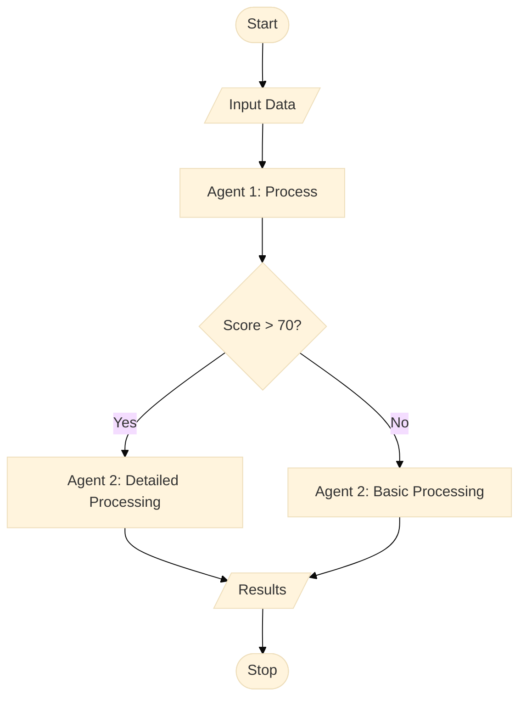

# Development Guide

This guide covers setting up a development environment, running tests, and extending the ATS research and resume tailoring orchestration system.

## Table of Contents

1. [Development Environment Setup](#development-environment-setup)
2. [Project Structure](#project-structure)
3. [Running Tests](#running-tests)
4. [Adding New Agents](#adding-new-agents)
5. [Creating Custom Orchestras](#creating-custom-orchestras)
6. [Contributing Guidelines](#contributing-guidelines)
7. [Code Style and Standards](#code-style-and-standards)
8. [Release Process](#release-process)

## Development Environment Setup

### Prerequisites

- Python 3.8 or higher
- Git
- Virtual environment tool (venv, virtualenv, or conda)
- Code editor with Python support (VS Code, PyCharm, etc.)

### Initial Setup

```bash
# Clone the repository
git clone https://github.com/yourusername/ats-research.git
cd ats-research

# Create virtual environment
python -m venv venv

# Activate virtual environment
# On Windows:
venv\Scripts\activate
# On Unix/macOS:
source venv/bin/activate

# Install dependencies
pip install -r requirements.txt

# Install development dependencies
pip install -r requirements-dev.txt

# Install pre-commit hooks
pre-commit install

# Set up environment variables
cp .env.example .env
# Edit .env with your API keys

# Run tests to verify setup
pytest
```

### Development Dependencies

The `requirements-dev.txt` includes:

```txt
# Testing
pytest>=7.4.0
pytest-cov>=4.1.0
pytest-mock>=3.11.1
pytest-asyncio>=0.21.1

# Code quality
black>=23.7.0
isort>=5.12.0
flake8>=6.1.0
mypy>=1.5.0
pylint>=2.17.5

# Pre-commit hooks
pre-commit>=3.3.3

# Documentation
sphinx>=7.1.2
sphinx-rtd-theme>=1.3.0
myst-parser>=2.0.0

# Development tools
ipython>=8.14.0
ipdb>=0.13.13
```

### Editor Configuration

#### VS Code

Create `.vscode/settings.json`:

```json
{
  "python.linting.enabled": true,
  "python.linting.pylintEnabled": true,
  "python.linting.flake8Enabled": true,
  "python.formatting.provider": "black",
  "python.formatting.blackArgs": ["--line-length", "100"],
  "editor.formatOnSave": true,
  "python.testing.pytestEnabled": true,
  "python.testing.pytestArgs": ["tests"],
  "[python]": {
    "editor.codeActionsOnSave": {
      "source.organizeImports": true
    }
  }
}
```

#### PyCharm

1. Go to Settings → Tools → Python Integrated Tools
2. Set Default test runner to pytest
3. Go to Settings → Editor → Code Style → Python
4. Set line length to 100
5. Enable "Black" as the formatter

## Project Structure

```
ats-research/
├── .github/                    # GitHub-specific files
│   └── workflows/              # CI/CD workflows
│       ├── tests.yml           # Run tests on push
│       └── lint.yml            # Code quality checks
│
├── data/                       # Data files
│   ├── test/                   # Test fixtures
│   ├── output/                 # Generated outputs (gitignored)
│   └── states/                 # Workflow states (gitignored)
│
├── docs/                       # Documentation
│   ├── README.md               # Documentation index
│   ├── architecture.md         # Architecture guide
│   ├── configuration.md        # Configuration reference
│   ├── usage.md                # Usage guide
│   └── development.md          # This file
│
├── src/                        # Source code
│   ├── __init__.py
│   ├── main.py                 # Entry point
│   ├── config.py               # Configuration management
│   │
│   ├── agents/                 # Agent implementations
│   │   ├── __init__.py
│   │   ├── base.py             # Base agent class
│   │   ├── company_research.py
│   │   ├── jd_parser.py
│   │   ├── requirement_matcher.py
│   │   ├── resume_tailoring.py
│   │   ├── cover_letter_writer.py
│   │   ├── fact_checker.py
│   │   └── pruning.py
│   │
│   ├── orchestras/             # Orchestra implementations
│   │   ├── __init__.py
│   │   ├── base.py             # Base orchestra class
│   │   ├── main_orchestrator.py
│   │   ├── company_research.py
│   │   ├── tailoring.py
│   │   ├── jd_matching.py
│   │   ├── writing.py
│   │   ├── fact_checker.py
│   │   └── pruning.py
│   │
│   ├── llm/                    # LLM provider integrations
│   │   ├── __init__.py
│   │   ├── base.py             # Base LLM provider
│   │   ├── claude.py           # Claude/Anthropic
│   │   ├── gpt.py              # OpenAI GPT
│   │   └── gemini.py           # Google Gemini
│   │
│   └── utils/                  # Shared utilities
│       ├── __init__.py
│       ├── file_io.py          # File operations
│       ├── state_manager.py    # State persistence
│       ├── html_parser.py      # HTML parsing
│       ├── markdown_utils.py   # Markdown utilities
│       └── scoring.py          # Match scoring utilities
│
├── tests/                      # Test suite
│   ├── __init__.py
│   ├── conftest.py             # Pytest configuration
│   │
│   ├── agents/                 # Agent tests
│   │   ├── test_company_research.py
│   │   ├── test_jd_parser.py
│   │   ├── test_requirement_matcher.py
│   │   ├── test_resume_tailoring.py
│   │   ├── test_cover_letter_writer.py
│   │   ├── test_fact_checker.py
│   │   └── test_pruning.py
│   │
│   ├── orchestras/             # Orchestra tests
│   │   ├── test_main_orchestrator.py
│   │   └── ...
│   │
│   ├── llm/                    # LLM provider tests
│   │   ├── test_claude.py
│   │   └── ...
│   │
│   └── utils/                  # Utility tests
│       └── ...
│
├── config/                     # Configuration files
│   ├── default_config.yaml     # Default configuration
│   ├── agents.yaml             # Agent configurations
│   └── llm_providers.yaml      # LLM provider configs
│
├── .env.example                # Example environment variables
├── .gitignore                  # Git ignore rules
├── .pre-commit-config.yaml     # Pre-commit hooks
├── pyproject.toml              # Project metadata
├── requirements.txt            # Production dependencies
├── requirements-dev.txt        # Development dependencies
├── LICENSE                     # MIT License
└── README.md                   # Project overview
```

## Running Tests

### Running All Tests

```bash
# Run all tests
pytest

# Run with coverage
pytest --cov=src --cov-report=html

# View coverage report
open htmlcov/index.html  # macOS
start htmlcov/index.html  # Windows
```

### Running Specific Tests

```bash
# Run tests for a specific module
pytest tests/agents/test_jd_parser.py

# Run a specific test function
pytest tests/agents/test_jd_parser.py::test_parse_requirements

# Run tests matching a pattern
pytest -k "jd_parser"

# Run with verbose output
pytest -v

# Run with print statements visible
pytest -s
```

### Test Fixtures

Common fixtures are defined in `tests/conftest.py`:

```python
import pytest
from src.config import Config

@pytest.fixture
def config():
    """Load test configuration"""
    return Config.from_file("config/test_config.yaml")

@pytest.fixture
def sample_jd_html():
    """Load sample job description HTML"""
    with open("data/test/sample_jd.html", "r") as f:
        return f.read()

@pytest.fixture
def sample_master_resume():
    """Load sample master resume"""
    with open("data/test/sample_master_resume.md", "r") as f:
        return f.read()

@pytest.fixture
def mock_llm_response():
    """Mock LLM API response"""
    return {
        "content": "Sample generated content",
        "model": "claude-3-sonnet",
        "usage": {"input_tokens": 100, "output_tokens": 50}
    }
```

### Writing Tests

Example test structure:

```python
# tests/agents/test_jd_parser.py

import pytest
from src.agents.jd_parser import JDParserAgent

class TestJDParserAgent:
    """Test suite for JD Parser Agent"""

    def test_parse_requirements(self, config, sample_jd_html):
        """Test requirement extraction from JD"""
        agent = JDParserAgent(config)
        result = agent.parse(sample_jd_html)

        assert "required_skills" in result
        assert len(result["required_skills"]) > 0
        assert "Python" in result["required_skills"]

    def test_extract_keywords(self, config, sample_jd_html):
        """Test keyword extraction"""
        agent = JDParserAgent(config)
        result = agent.parse(sample_jd_html)

        assert "keywords" in result
        assert "microservices" in result["keywords"]

    @pytest.mark.parametrize("html,expected", [
        ("<h3>Required:</h3><ul><li>Python</li></ul>", ["Python"]),
        ("<h3>Requirements</h3><p>5+ years</p>", ["5+ years"]),
    ])
    def test_section_parsing(self, config, html, expected):
        """Test parsing of different HTML structures"""
        agent = JDParserAgent(config)
        # Test implementation
```

### Mocking LLM API Calls

```python
# tests/agents/test_resume_tailoring.py

import pytest
from unittest.mock import Mock, patch
from src.agents.resume_tailoring import ResumeTailoringAgent

@patch('src.llm.claude.ClaudeProvider.generate')
def test_tailor_resume(mock_generate, config, sample_master_resume, sample_match_results):
    """Test resume tailoring with mocked LLM"""

    # Mock LLM response
    mock_generate.return_value = {
        "tailored_resume": {...},
        "highlighted_skills": [...]
    }

    agent = ResumeTailoringAgent(config)
    result = agent.tailor(
        master_resume=sample_master_resume,
        match_results=sample_match_results
    )

    # Verify LLM was called
    assert mock_generate.called
    assert "tailored_resume" in result
```

## Adding New Agents

### Step 1: Create Agent Class

Create a new file in `src/agents/`:

```python
# src/agents/my_new_agent.py

from typing import Dict, Any
from src.agents.base import BaseAgent

class MyNewAgent(BaseAgent):
    """
    Description of what this agent does.

    Inputs:
        - input1: Description
        - input2: Description

    Outputs:
        - output1: Description
        - output2: Description
    """

    def __init__(self, config):
        super().__init__(config)
        # Initialize agent-specific settings
        self.setting1 = config.agents.my_new_agent.setting1

    def process(self, input1: str, input2: Dict) -> Dict[str, Any]:
        """
        Main processing method.

        Args:
            input1: First input
            input2: Second input

        Returns:
            Dictionary with results
        """
        # Implement agent logic
        result = self._do_something(input1, input2)

        return {
            "output1": result,
            "output2": self._calculate_metrics(result)
        }

    def _do_something(self, input1: str, input2: Dict) -> Any:
        """Private helper method"""
        # Implementation
        pass

    def _calculate_metrics(self, data: Any) -> Dict:
        """Calculate metrics for the output"""
        # Implementation
        pass
```

### Step 2: Add Configuration

Add to `config/agents.yaml`:

```yaml
my_new_agent:
  enabled: true
  timeout: 60
  setting1: "value1"
  setting2: 100
```

### Step 3: Write Tests

Create `tests/agents/test_my_new_agent.py`:

```python
import pytest
from src.agents.my_new_agent import MyNewAgent

class TestMyNewAgent:

    def test_process(self, config):
        agent = MyNewAgent(config)
        result = agent.process("input1", {"key": "value"})

        assert "output1" in result
        assert "output2" in result

    def test_edge_case(self, config):
        agent = MyNewAgent(config)
        # Test edge cases
```

### Step 4: Integrate into Orchestra

Update relevant orchestra to use the new agent:

```python
# src/orchestras/some_orchestra.py

from src.agents.my_new_agent import MyNewAgent

class SomeOrchestra(BaseOrchestra):

    def __init__(self, config):
        super().__init__(config)
        self.my_agent = MyNewAgent(config)

    def run(self, state):
        # Use the new agent
        result = self.my_agent.process(state.input1, state.input2)
        state.new_output = result
        return state
```

### Step 5: Document

Add documentation to `docs/architecture.md` under "Agent Catalog".

## Creating Custom Orchestras

### Step 1: Define Orchestra Class

```python
# src/orchestras/my_custom_orchestra.py

from typing import Dict
from src.orchestras.base import BaseOrchestra
from src.agents.agent1 import Agent1
from src.agents.agent2 import Agent2

class MyCustomOrchestra(BaseOrchestra):
    """
    Description of what this orchestra does.

    Workflow:
        1. Step 1
        2. Step 2
        3. Step 3
    """

    def __init__(self, config):
        super().__init__(config, name="my_custom_orchestra")

        # Initialize required agents
        self.agent1 = Agent1(config)
        self.agent2 = Agent2(config)

    def run(self, state: Dict) -> Dict:
        """
        Execute the orchestra workflow.

        Args:
            state: Current workflow state

        Returns:
            Updated state with outputs
        """
        self.log_info("Starting custom orchestra")

        # Step 1: Run first agent
        result1 = self._run_step(
            "agent1",
            self.agent1.process,
            input1=state.get("input1")
        )

        # Step 2: Decision point
        if result1["score"] > 70:
            # High score path
            result2 = self._run_step(
                "agent2_detailed",
                self.agent2.process_detailed,
                data=result1
            )
        else:
            # Low score path
            result2 = self._run_step(
                "agent2_basic",
                self.agent2.process_basic,
                data=result1
            )

        # Update state
        state["result1"] = result1
        state["result2"] = result2
        state["status"] = "custom_orchestra_complete"

        return state

    def _run_step(self, step_name: str, func, **kwargs):
        """
        Execute a single step with error handling and logging.

        Args:
            step_name: Name of the step for logging
            func: Function to execute
            **kwargs: Arguments to pass to func

        Returns:
            Result from func
        """
        self.log_info(f"Running step: {step_name}")

        try:
            result = func(**kwargs)
            self.log_success(f"Step {step_name} completed")
            return result
        except Exception as e:
            self.log_error(f"Step {step_name} failed: {e}")
            raise
```

### Step 2: Create Mermaid Diagram

Create a workflow diagram:



Save as `XX.MyCustomOrchestra.mmd` (where XX is the sequence number).

### Step 3: Add Tests

```python
# tests/orchestras/test_my_custom_orchestra.py

import pytest
from src.orchestras.my_custom_orchestra import MyCustomOrchestra

class TestMyCustomOrchestra:

    def test_run_high_score_path(self, config):
        """Test workflow with high score"""
        orchestra = MyCustomOrchestra(config)

        state = {
            "input1": "test input"
        }

        result = orchestra.run(state)

        assert result["status"] == "custom_orchestra_complete"
        assert "result1" in result
        assert "result2" in result

    def test_run_low_score_path(self, config):
        """Test workflow with low score"""
        # Similar test for low score path
```

### Step 4: Integrate into Main Orchestrator

```python
# src/orchestras/main_orchestrator.py

from src.orchestras.my_custom_orchestra import MyCustomOrchestra

class MainOrchestrator:

    def __init__(self, config):
        # ...
        self.my_custom_orchestra = MyCustomOrchestra(config)

    def run_full_workflow(self, state):
        # ...

        # Add to workflow
        if config.workflow.enabled_stages["my_custom_stage"]:
            state = self.my_custom_orchestra.run(state)

        # ...
```

## Contributing Guidelines

### Contribution Workflow

1. **Fork the repository**
2. **Create a feature branch**: `git checkout -b feature/my-feature`
3. **Make changes** with tests
4. **Run tests and linting**: `pytest && black . && flake8`
5. **Commit with conventional commits**: `git commit -m "feat: add new agent"`
6. **Push to your fork**: `git push origin feature/my-feature`
7. **Create pull request**

### Commit Message Format

Follow [Conventional Commits](https://www.conventionalcommits.org/):

```
<type>(<scope>): <subject>

<body>

<footer>
```

**Types**:
- `feat`: New feature
- `fix`: Bug fix
- `docs`: Documentation changes
- `style`: Code style changes (formatting, etc.)
- `refactor`: Code refactoring
- `test`: Test additions or changes
- `chore`: Build process or auxiliary tool changes

**Examples**:
```
feat(agents): add LinkedIn profile scraper agent

Add new agent to scrape and parse LinkedIn profiles for
company culture research.

Closes #42
```

```
fix(jd-parser): handle missing job requirements section

Some job postings don't have explicit "Requirements" section.
Updated parser to extract from multiple possible locations.
```

### Pull Request Guidelines

1. **Title**: Use conventional commit format
2. **Description**:
   - What problem does this solve?
   - How does it solve it?
   - Any breaking changes?
3. **Tests**: Include tests for new functionality
4. **Documentation**: Update relevant docs
5. **Changelog**: Add entry to CHANGELOG.md

### Code Review Checklist

- [ ] Tests pass
- [ ] Code follows style guide
- [ ] Documentation updated
- [ ] No unnecessary dependencies added
- [ ] Backward compatible (or breaking changes documented)
- [ ] Performance impact considered

## Code Style and Standards

### Python Style Guide

Follow [PEP 8](https://pep8.org/) with these specifics:

- **Line length**: 100 characters
- **Indentation**: 4 spaces
- **Quotes**: Double quotes for strings
- **Imports**: Organized with isort

### Type Hints

Use type hints for all function signatures:

```python
from typing import List, Dict, Optional, Any

def process_data(
    input_data: Dict[str, Any],
    options: Optional[List[str]] = None
) -> Dict[str, Any]:
    """Process input data with optional settings."""
    # Implementation
```

### Docstrings

Use Google-style docstrings:

```python
def match_requirements(
    resume: Dict[str, Any],
    job_requirements: List[str],
    threshold: float = 0.5
) -> Dict[str, Any]:
    """
    Match resume experience to job requirements.

    Args:
        resume: Parsed resume data with experiences and skills
        job_requirements: List of requirement strings from JD
        threshold: Minimum similarity threshold (0.0 to 1.0)

    Returns:
        Dictionary containing:
            - matched_requirements: List of matched requirements
            - match_scores: Dict mapping requirement to score
            - unmatched: List of unmatched requirements

    Raises:
        ValueError: If threshold is not between 0 and 1

    Example:
        >>> resume = {"experiences": [...], "skills": [...]}
        >>> requirements = ["Python", "5+ years experience"]
        >>> result = match_requirements(resume, requirements)
        >>> print(result["match_scores"])
        {"Python": 0.95, "5+ years experience": 0.88}
    """
    # Implementation
```

### Logging

Use structured logging:

```python
import logging

logger = logging.getLogger(__name__)

def process_jd(jd_html: str):
    logger.info("Starting JD processing", extra={"jd_length": len(jd_html)})

    try:
        result = parse_html(jd_html)
        logger.info("JD processing complete", extra={"requirements_found": len(result)})
        return result
    except Exception as e:
        logger.error("JD processing failed", extra={"error": str(e)}, exc_info=True)
        raise
```

### Error Handling

Be specific with exceptions:

```python
class JDParsingError(Exception):
    """Raised when job description parsing fails"""
    pass

class RequirementMatchingError(Exception):
    """Raised when requirement matching fails"""
    pass

def parse_jd(html: str):
    if not html:
        raise JDParsingError("Empty HTML provided")

    try:
        # Parsing logic
        pass
    except ValueError as e:
        raise JDParsingError(f"Invalid HTML structure: {e}") from e
```

## Release Process

### Version Numbering

Follow [Semantic Versioning](https://semver.org/):
- **MAJOR**: Incompatible API changes
- **MINOR**: New functionality (backward compatible)
- **PATCH**: Bug fixes (backward compatible)

### Release Checklist

1. **Update version** in `pyproject.toml`
2. **Update CHANGELOG.md**
3. **Run full test suite**: `pytest`
4. **Build documentation**: `cd docs && make html`
5. **Create git tag**: `git tag -a v1.2.3 -m "Release 1.2.3"`
6. **Push tag**: `git push origin v1.2.3`
7. **Create GitHub release** with changelog
8. **Publish to PyPI** (if applicable): `python -m build && twine upload dist/*`

### Changelog Format

```markdown
# Changelog

## [1.2.3] - 2024-01-15

### Added
- New LinkedIn profile scraper agent
- Support for PDF job descriptions

### Changed
- Improved keyword extraction algorithm
- Updated Claude to use latest model

### Fixed
- Fixed date parsing for international formats
- Resolved timeout issues with long JDs

### Deprecated
- Old `parse_jd_v1` method (use `parse_jd` instead)

### Removed
- Removed deprecated `OldAgent` class
```

## Next Steps

- Review [Architecture Guide](architecture.md) for system design
- Check [Configuration Guide](configuration.md) for settings
- See [Usage Guide](usage.md) for practical examples
